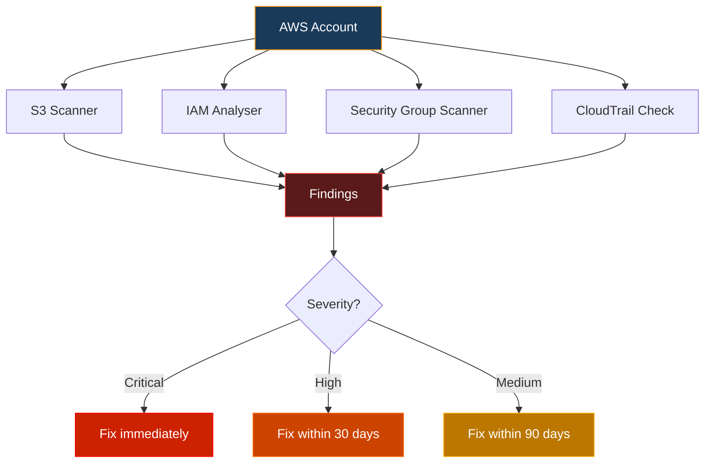
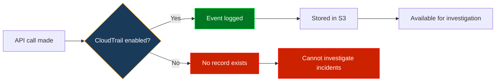
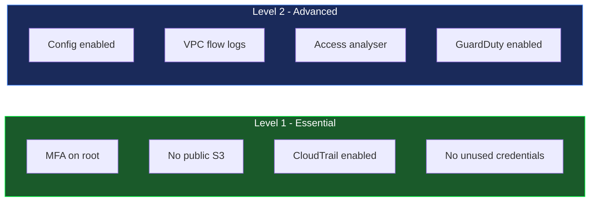
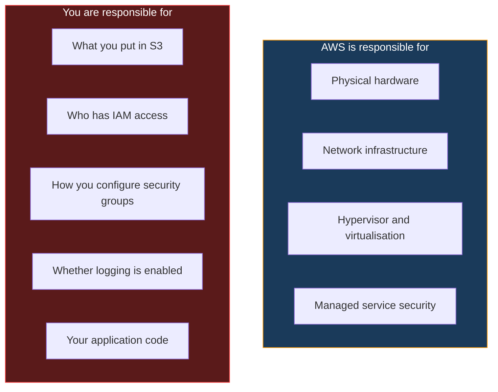

<div align="center">


<br/>


</div>

---

## Who this is for

This project is for students learning cybersecurity who want to understand what cloud security work actually looks like. Cloud security is one of the fastest growing areas in the industry right now. Almost every organisation has moved at least part of their infrastructure to AWS, Azure or GCP, and most of them have misconfigurations they do not know about.

This project teaches you how to find those misconfigurations, why they are dangerous and how to fix them.

---

## Why cloud security matters

The biggest data breaches in recent years were not caused by sophisticated zero-day exploits. They were caused by simple misconfigurations.

A public S3 bucket. An IAM user with admin access that should not have it. A database port open to the entire internet. A CloudTrail trail that was accidentally disabled six months ago and nobody noticed.

These are the things this project finds.



---

## What gets scanned

### S3 buckets

S3 is AWS object storage. It is used to store everything from application assets to database backups. A misconfigured S3 bucket is one of the most common causes of data breaches.

```
S3 Security Scan
============================================================
Issues found: 3

[CRITICAL] company-backups
  Finding : Block Public Access is not fully enabled
  Risk    : Anyone on the internet may be able to read files from this bucket
  Fix     : Enable all four Block Public Access settings immediately

[HIGH] app-uploads
  Finding : Default encryption is not configured
  Risk    : Objects stored in this bucket are not encrypted at rest
  Fix     : Enable AES-256 or AWS KMS encryption on the bucket

[MEDIUM] dev-logs
  Finding : Access logging is not enabled
  Risk    : No audit trail of who accessed or modified objects in this bucket
  Fix     : Enable server access logging
```

What the scanner checks:

```
Block Public Access       is the bucket accidentally open to the internet?
Default encryption        are files encrypted when stored?
Versioning                can deleted files be recovered?
Access logging            is there an audit trail?
```

### IAM users and policies

IAM (Identity and Access Management) controls who can do what in your AWS account. The most common problem is users having far more permissions than they need.

```
IAM Security Analysis
============================================================
Issues found: 2

[HIGH] developer1
  Finding : User has overly permissive policy: AdministratorAccess
  Risk    : If credentials are compromised the attacker gains full account access
  Fix     : Replace with a scoped policy covering only what this user needs

[HIGH] ci-pipeline
  Finding : MFA is not enabled
  Risk    : Account can be taken over with just a username and password
  Fix     : Enable MFA for this user immediately
```

The principle of least privilege means every user should only have exactly the permissions they need, nothing more.

### Security groups

Security groups are AWS firewalls. They control what network traffic is allowed in and out of your resources. Opening dangerous ports to the entire internet is a common mistake.

```
Security Group Scan
============================================================
Issues found: 2

[CRITICAL] sg-web-server
  Finding : Port 22 (SSH) is open to the entire internet
  Risk    : SSH is exposed to 0.0.0.0/0 anyone can attempt connections
  Fix     : Restrict SSH to specific IP addresses or a VPN

[HIGH] sg-database
  Finding : Port 3306 (MySQL) is open to the entire internet
  Risk    : Database is directly accessible from anywhere on the internet
  Fix     : Remove the public rule and allow access only from application servers
```

### CloudTrail logging

CloudTrail records every API call made in your AWS account. It is your audit trail. If logging is disabled, you have no way to investigate an incident or prove that something happened.



---

## The CIS AWS Foundations Benchmark

The Center for Internet Security (CIS) publishes a benchmark specifically for AWS. It contains over 50 specific security checks, each with a pass/fail criteria and remediation steps. This is the standard that security teams and auditors use to assess AWS environments.



Level 1 controls are the baseline. Every AWS account should pass all of them. This project checks the most critical Level 1 controls.

The full benchmark is free at [cisecurity.org](https://www.cisecurity.org/benchmark/amazon_web_services).

---

## The shared responsibility model

One of the most important concepts in cloud security is understanding what AWS is responsible for and what you are responsible for.



AWS secures the infrastructure. You are responsible for everything you build on top of it. Most cloud breaches happen because customers misconfigured their own resources, not because AWS was hacked.

---

## Project structure

```
cloud-security/
├── aws/
│   ├── s3/
│   │   └── s3_scanner.py       <- checks S3 bucket misconfigurations
│   ├── iam/
│   │   └── iam_analyser.py     <- checks IAM users and policies
│   ├── network/
│   │   └── sg_scanner.py       <- checks security group rules
│   ├── logging/
│   │   └── cloudtrail_check.py <- checks CloudTrail configuration
│   └── run_all.py              <- runs all scanners at once
├── frameworks/
│   └── cis-aws-benchmark.md    <- CIS AWS Foundations Benchmark explained
├── templates/
│   └── remediation-report.md   <- template for documenting findings
├── resources/
│   └── README.md               <- free learning resources for cloud security
├── tests/
└── requirements.txt
```

---

## Setup

You need an AWS account. AWS Free Tier is enough to run these scanners against your own account. Sign up at [aws.amazon.com](https://aws.amazon.com).

Install the AWS CLI and configure credentials:

```bash
pip install awscli
aws configure
```

Clone and install:

```bash
git clone https://github.com/Speed-boo3/cloud-security.git
cd cloud-security
pip install -r requirements.txt
```

Run a scan:

```bash
cd aws
python s3/s3_scanner.py --region eu-west-1
python iam/iam_analyser.py
python network/sg_scanner.py --region eu-west-1
python logging/cloudtrail_check.py --region eu-west-1
python run_all.py --output results.json
```

---

## What cloud security jobs look like

Cloud security roles appear under several job titles:

```
Cloud Security Engineer       builds and maintains security controls in cloud environments
Security Architect (Cloud)    designs secure cloud architectures from scratch
Cloud GRC Analyst             assesses compliance of cloud environments against frameworks
DevSecOps Engineer            integrates security into cloud deployment pipelines
Penetration Tester (Cloud)    tests cloud environments for vulnerabilities
```

The skills this project demonstrates are directly relevant to all of them. Understanding IAM, knowing why S3 buckets get misconfigured, being able to read and act on security group rules and audit trails are all things interviewers will ask about.

---

## Free resources

The `resources/` folder has a full list. Key ones:

- [AWS Security Best Practices](https://aws.amazon.com/security/security-resources/)
- [CIS AWS Foundations Benchmark](https://www.cisecurity.org/benchmark/amazon_web_services)
- [AWS Free Tier](https://aws.amazon.com/free/) for hands-on practice
- [AWS Security documentation](https://docs.aws.amazon.com/security/)
- [Cloud Security Alliance](https://cloudsecurityalliance.org/research/guidance)

<div align="center">

</div>
