<div align="center">


<br/>


<br/>

[](https://speed-boo3.github.io/cloud-security/explain/)

</div>

---

## What this project is

Most cloud data breaches are not caused by sophisticated attacks. They are caused by misconfigurations — a public S3 bucket, an IAM user with admin access, a database port open to the internet, an audit trail that was accidentally disabled.

This project finds those misconfigurations automatically. Four scanners, a CIS compliance score calculator, a full demo mode that works without AWS credentials, and an interactive learning site that explains everything from scratch.

---

## Try it now — no AWS account needed

```bash
git clone https://github.com/Speed-boo3/cloud-security.git
cd cloud-security
pip install -r requirements.txt

python aws/demo_mode.py
python aws/compliance_score.py --demo
```



---

## The attack surface



Every misconfiguration is a door. This project finds the open doors.

---

## The four scanners

### S3 — Storage misconfiguration

S3 is the most common source of cloud data breaches. A single misconfigured bucket can expose millions of records to anyone on the internet.

```bash
python aws/s3/s3_scanner.py --region eu-west-1
```

```
[CRITICAL]  company-backups-prod
  Finding  : Block Public Access is not fully enabled
  Risk     : Anyone on the internet can read files from this bucket
  Fix      : Enable all four Block Public Access settings immediately

[HIGH]     app-user-uploads
  Finding  : Default encryption is not configured
  Risk     : Objects are not encrypted at rest
  Fix      : Enable AES-256 or AWS KMS encryption
```

What gets checked on every bucket:

```
Block Public Access    is the bucket accidentally open to the internet?
Default encryption     are files encrypted when stored?
Versioning             can deleted files be recovered?
Access logging         is there an audit trail of who accessed what?
```

### IAM — Identity and Access Management

IAM controls who can do what in your AWS account. The most common mistake is giving users far more permissions than they need.

```bash
python aws/iam/iam_analyser.py
```

```
[HIGH]     developer1
  Finding  : User has AdministratorAccess policy attached
  Risk     : Full account takeover if credentials are ever leaked
  Fix      : Replace with a scoped policy for this user's actual role

[HIGH]     ci-pipeline
  Finding  : MFA is not enabled
  Risk     : Account can be taken over with username and password alone
  Fix      : Enable MFA. For CI/CD consider IAM roles instead of users

[MEDIUM]   backup-service
  Finding  : Access key is 143 days old (threshold: 90 days)
  Risk     : Old keys increase the window of exposure if ever leaked
  Fix      : Rotate the key and enforce a 90-day rotation policy
```

### Security Groups — Network exposure

Security groups are AWS firewalls. Leaving dangerous ports open to the entire internet is one of the most scanned configurations on the internet.

```bash
python aws/network/sg_scanner.py --region eu-west-1
```

```
[CRITICAL]  web-server-sg
  Finding  : Port 22 (SSH) is open to 0.0.0.0/0
  Risk     : SSH exposed to every IP. Constant brute force target
  Fix      : Restrict to VPN CIDR or specific trusted IPs only

[CRITICAL]  database-sg
  Finding  : Port 3306 (MySQL) is open to 0.0.0.0/0
  Risk     : Database directly accessible from the internet
  Fix      : Allow only from your application server security group
```

Ports the scanner flags and why:

```
22     SSH          brute force and CVE target — never public
3389   RDP          constant attack target, multiple critical CVEs
3306   MySQL        databases must never be internet-facing
5432   PostgreSQL   same reason as MySQL
6379   Redis        often runs with no authentication by default
27017  MongoDB      thousands of databases wiped by attackers this way
21     FTP          credentials sent in plaintext
23     Telnet       everything unencrypted, replaced by SSH in the 1990s
```

### CloudTrail — Audit logging

CloudTrail records every API call in your AWS account. Without it, you cannot investigate incidents.

```bash
python aws/logging/cloudtrail_check.py --region eu-west-1
```

```
[MEDIUM]   mgmt-trail
  Finding  : Trail is not configured for multi-region logging
  Risk     : Activity in other regions leaves no audit trail
  Fix      : Enable multi-region logging on the trail
```

---

## CIS compliance scoring

The CIS AWS Foundations Benchmark is the standard security teams and auditors use to assess AWS environments. This tool calculates your Level 1 score and shows exactly what to fix and by when.

```bash
python aws/compliance_score.py --demo
python aws/compliance_score.py --results results.json
```

```
════════════════════════════════════════════════════════════════
  CIS AWS FOUNDATIONS BENCHMARK — LEVEL 1
────────────────────────────────────────────────────────────────
  Compliance score : 57%  (8/14 controls passing)
════════════════════════════════════════════════════════════════

  Identity and Access Management  40%
    ✓  1.1  MFA enabled on root account
    ✓  1.2  No access keys on root account
    ✗  1.3  MFA enabled for all IAM console users  → fix within 30 days
    ✗  1.5  No overly permissive IAM policies       → fix within 30 days

  Storage  100%
    ✓  3.1  S3 Block Public Access enabled
    ✓  3.2  S3 buckets encrypted at rest
    ✓  3.3  S3 access logging enabled

  Networking  67%
    ✗  4.1  SSH (port 22) not open to 0.0.0.0/0  → fix immediately
    ✓  4.2  RDP (port 3389) not open to 0.0.0.0/0
    ✓  4.3  Databases not publicly accessible
```

---

## Run everything at once

```bash
cd aws
python run_all.py --region eu-west-1 --output results.json
python compliance_score.py --results results.json
```

---

## What cloud security roles look like

```
Cloud Security Engineer      builds and maintains security controls in cloud environments
Security Architect           designs secure cloud architectures for new and existing systems
Cloud GRC Analyst            assesses cloud compliance against CIS, ISO 27001, NIST
DevSecOps Engineer           integrates security into cloud deployment pipelines
Penetration Tester (Cloud)   tests cloud environments for misconfigurations and vulnerabilities
```

The skills this project demonstrates are directly relevant to all of them. Understanding IAM, knowing why S3 misconfiguration causes breaches, being able to read security group rules and calculate compliance scores — these are the things interviewers ask about.

---

## Project structure

```
cloud-security/
├── aws/
│   ├── s3/
│   │   └── s3_scanner.py          <- Block Public Access, encryption, versioning, logging
│   ├── iam/
│   │   └── iam_analyser.py        <- overprivileged users, missing MFA, old keys
│   ├── network/
│   │   └── sg_scanner.py          <- dangerous ports open to the internet
│   ├── logging/
│   │   └── cloudtrail_check.py    <- audit logging configuration
│   ├── utils/
│   │   └── colors.py              <- coloured terminal output for all scanners
│   ├── demo_mode.py               <- realistic mock scan, no AWS account needed
│   ├── compliance_score.py        <- CIS Level 1 compliance calculator
│   └── run_all.py                 <- runs all four scanners in sequence
├── assets/                        <- SVG diagrams in README
├── frameworks/
│   └── cis-aws-benchmark.md       <- CIS AWS Foundations Benchmark explained
├── templates/
│   └── remediation-report.md      <- finding documentation template
├── resources/
│   └── README.md                  <- free learning resources
├── explain/
│   └── index.html                 <- interactive learning site
└── CHANGELOG.md
```

---

## Setup for real AWS scanning

You need an AWS account. The Free Tier is enough.

```bash
pip install awscli
aws configure
cd aws
python run_all.py --region eu-west-1 --output results.json
python compliance_score.py --results results.json
```

---

## Free resources

- [AWS Free Tier](https://aws.amazon.com/free/) — free account to test with
- [CIS AWS Foundations Benchmark](https://www.cisecurity.org/benchmark/amazon_web_services) — free PDF
- [AWS Security Best Practices](https://aws.amazon.com/security/security-resources/)
- [AWS Security Fundamentals — free course](https://explore.skillbuilder.aws/learn/course/48)
- [Cloud Security Alliance guidance](https://cloudsecurityalliance.org/research/guidance)

<div align="center">

</div>
