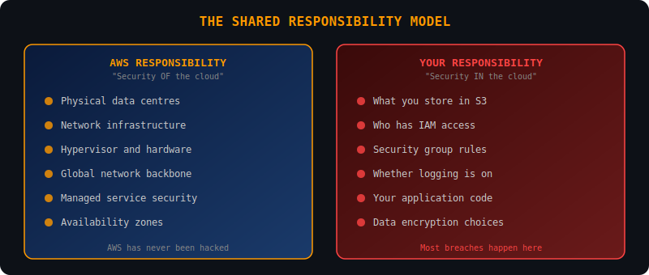
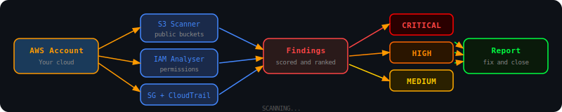
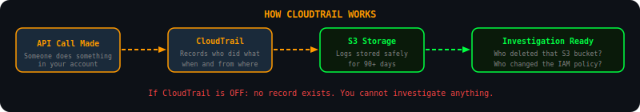
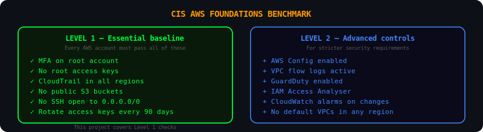

<div align="center">


<br/>


</div>

---

## Who this is for

This project is for students learning cybersecurity who want to understand what cloud security work actually looks like in practice.

Cloud security is one of the fastest growing areas in the industry. Almost every organisation has moved infrastructure to AWS, Azure or GCP, and most of them have misconfigurations they do not know about. The biggest data breaches in recent years were not caused by sophisticated exploits. They were caused by a public S3 bucket, an IAM user with admin access that should not have it, or a database port open to the entire internet.

This project finds exactly those things.

---

## The shared responsibility model

The most important concept in cloud security. AWS secures the infrastructure. You are responsible for everything you build on top of it.



Most cloud breaches happen on the right side of that diagram. Things you configured. Things you forgot to lock down. This is what cloud security work is about.

---

## How the scanners work



Four scanners run against your AWS account and produce a unified findings report, sorted by severity.

---

## What gets scanned

### S3 buckets

S3 is AWS object storage. A misconfigured bucket is one of the most common causes of data breaches. The scanner checks each bucket for four things:

```
Block Public Access       is the bucket accidentally open to the internet?
Default encryption        are files encrypted when stored?
Versioning                can deleted files be recovered?
Access logging            is there an audit trail?
```

```bash
python aws/s3/s3_scanner.py --region eu-west-1
```

```
S3 Security Scan
============================================================
Issues found: 2

[CRITICAL] company-backups
  Finding : Block Public Access is not fully enabled
  Risk    : Anyone on the internet may be able to read files from this bucket
  Fix     : Enable all four Block Public Access settings immediately

[HIGH] app-uploads
  Finding : Default encryption is not configured
  Risk    : Objects stored in this bucket are not encrypted at rest
  Fix     : Enable AES-256 or AWS KMS encryption
```

### IAM users and policies

IAM controls who can do what in your AWS account. The principle of least privilege means every user should have only the permissions they need, nothing more.

```bash
python aws/iam/iam_analyser.py
```

```
IAM Security Analysis
============================================================
Issues found: 2

[HIGH] developer1
  Finding : User has overly permissive policy: AdministratorAccess
  Risk    : If credentials are compromised the attacker gains full account access
  Fix     : Replace with a scoped policy covering only what this user needs

[HIGH] ci-pipeline
  Finding : MFA is not enabled
  Risk    : Account can be taken over with just a username and password
  Fix     : Enable MFA for this user immediately
```

### Security groups

Security groups are AWS firewalls. Opening dangerous ports to the entire internet is a mistake that attackers scan for constantly.

```bash
python aws/network/sg_scanner.py --region eu-west-1
```

```
Security Group Scan
============================================================
Issues found: 1

[CRITICAL] sg-web-server
  Finding : Port 22 (SSH) is open to the entire internet
  Risk    : SSH is exposed to 0.0.0.0/0, anyone can attempt connections
  Fix     : Restrict SSH to specific IP addresses or a VPN only
```

Ports the scanner flags and why:

```
Port 22    SSH         brute force target, must never be public
Port 3389  RDP         multiple critical CVEs, constant attack target
Port 3306  MySQL       databases must never be directly internet-facing
Port 5432  PostgreSQL  same reason as MySQL
Port 6379  Redis       often ships with no authentication by default
Port 27017 MongoDB     thousands of databases wiped by attackers this way
Port 21    FTP         credentials sent in plaintext
Port 23    Telnet      everything unencrypted, replaced by SSH in the 1990s
Port 8080  HTTP Alt    dev servers often run here without encryption
```

### CloudTrail

CloudTrail records every API call in your account. It is your audit trail. Without it, you cannot investigate incidents.



```bash
python aws/logging/cloudtrail_check.py --region eu-west-1
```

---

## The CIS AWS Foundations Benchmark

The CIS benchmark is the standard that security teams and auditors use to assess AWS environments. This project checks the most critical Level 1 controls.



The full benchmark is free at [cisecurity.org](https://www.cisecurity.org/benchmark/amazon_web_services).

---

## Run everything at once

```bash
cd aws
python run_all.py --region eu-west-1 --output results.json
```

```
============================================================
  AWS CLOUD SECURITY SCAN
============================================================

[1/4] Scanning S3 buckets...
[2/4] Analysing IAM users...
[3/4] Scanning security groups...
[4/4] Checking CloudTrail...

============================================================
  SUMMARY
============================================================
  Total issues : 7
  Critical     : 2
  High         : 3
  Medium       : 2
============================================================
```

---

## What cloud security jobs look like

```
Cloud Security Engineer       builds and maintains security controls in cloud environments
Security Architect (Cloud)    designs secure cloud architectures from scratch
Cloud GRC Analyst             assesses cloud compliance against CIS and ISO 27001
DevSecOps Engineer            integrates security into cloud deployment pipelines
Penetration Tester (Cloud)    tests cloud environments for vulnerabilities
```

The skills this project demonstrates are directly relevant to all of them. Understanding IAM, knowing why S3 buckets get misconfigured, reading security group rules and audit trails are exactly what interviewers ask about.

---

## Setup

You need an AWS account. The AWS Free Tier is enough to run all these scanners. Sign up at [aws.amazon.com/free](https://aws.amazon.com/free/).

```bash
pip install awscli
aws configure
```

```bash
git clone https://github.com/Speed-boo3/cloud-security.git
cd cloud-security
pip install -r requirements.txt
```

---

## Project structure

```
cloud-security/
├── aws/
│   ├── s3/
│   │   └── s3_scanner.py         <- public buckets, encryption, versioning, logging
│   ├── iam/
│   │   └── iam_analyser.py       <- overprivileged users, missing MFA, old keys
│   ├── network/
│   │   └── sg_scanner.py         <- dangerous ports open to the internet
│   ├── logging/
│   │   └── cloudtrail_check.py   <- audit logging configuration
│   └── run_all.py                <- runs all four scanners
├── assets/                       <- SVG diagrams used in README
├── frameworks/
│   └── cis-aws-benchmark.md      <- CIS AWS Foundations Benchmark explained
├── templates/
│   └── remediation-report.md     <- template for documenting findings
└── resources/
    └── README.md                 <- free learning resources for cloud security
```

---

## Free resources

Everything in `resources/README.md` is free.

- [AWS Security Best Practices](https://aws.amazon.com/security/security-resources/)
- [CIS AWS Foundations Benchmark](https://www.cisecurity.org/benchmark/amazon_web_services)
- [AWS Free Tier](https://aws.amazon.com/free/) for hands-on practice
- [AWS Security Fundamentals (free course)](https://explore.skillbuilder.aws/learn/course/48)
- [Cloud Security Alliance guidance](https://cloudsecurityalliance.org/research/guidance)

<div align="center">

</div>
